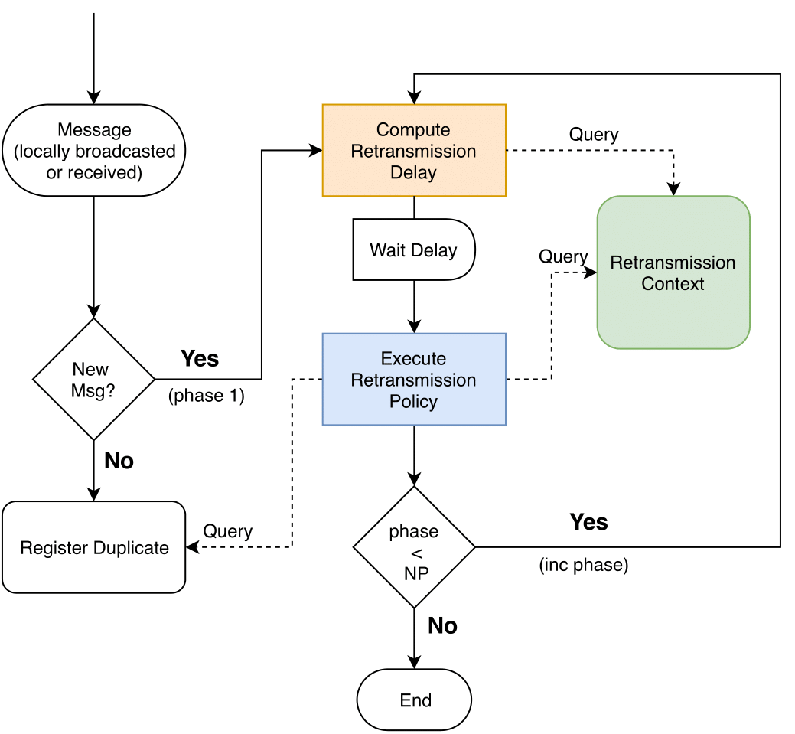

# ad hoc Communication Primitives
This repository contains a library of communication primitives for wireless ad hoc networks.
Currently, this library only contains a framework for specifying Broadcast protocols (Routing primitives to be added in the future).

This library was implemented on top of the ([Yggdrasil](https://github.com/LightKone/Yggdrasil)) framework.

## Broadcast Framework's

A great part of broadcast algorithms for wireless ad hoc networks share a similar execution pattern, which motivated us to devise a framework to easily specify them.

To promote the focus of the framework over the key aspects of broadcast protocols, the framework abstracts common, but essential, aspects that are prevalent in the design of such protocols, including:
* the tracking of messages already delivered (to avoid duplicates)
* the gathering of environmental information that is provided (locally) to each protocol, which is used to affect its local decisions
* the scheduling of retransmissions. 

The code for the framework is located on [CommunicationPrimitives/protocols/broadcast/framework/](CommunicationPrimitives/protocols/broadcast/framework/).

The execution flow of the framework is depicted int the following figure:



Upon the broadcast of a message by a node, its neighbors, upon receiving it, verify if it is a new message or a duplicate (Each message is uniquely identified by a uuid). 
If it is a duplicate, and if the framework is still processing that message, its reception is merely recorded. 

Each registered message has the following structure:
```c
typedef struct _message_item {
	uuid_t id;                    // Message id
	YggMessage toDeliver;         // Message to Deliver
	bool active;                  // Flag that indicates that the current message is still active, and thus cannot be discarded
	double_list* copies;          // List of the headers of the received copies
	int current_phase;            // Message's current phase
	int retransmissions;	      // Number of retransmissions of the message
	unsigned long timer_duration; // Amount of time setup for the current timer
} message_item;
```

And each copy received has the following structure:

```c
typedef struct _message_copy {
	struct timespec reception_time;  // Timestamp of the moment the copy was received
	bcast_header header;		 // Broadcast Header
	void* context_header;		 // Retransmission Context
	unsigned int phase;		 // Phase in which the copy was received
} message_copy;
```

Otherwise, if it is the first reception, the retransmission process begins.
First, a Retransmission Delay is computed. 
The objectives of this delay are:
* avoid collisions on the wireless medium (preventing nodes from retransmitting at the same time) 
* provide a period to aggregate information.

This delay is computed applying a function that corresponds to a parameter of the framework, and has the following interface:
* `unsigned long delay(void* args, void* state, message_item* msg_item, RetransmissionContext* r_context)`
With:
* `void* args`: Pointer to the specific arguments of the delay fuction (optional).
* `void* state`: Pointer to the state of the delay function (optional), that is shared between multiple calls of the fucntion.
* `message_item* msg_item`: Pointer to the message being processed.
* `RetransmissionContext* r_context`: Pointer to the Retransmission Context in order to query it if necessary. (Explained below)

Examples of Retransmission Delays can be found on: [CommunicationPrimitives/protocols/broadcast/framework/r_delays/](CommunicationPrimitives/protocols/broadcast/framework/r_delays/).

Some of these functions may require access to external information. 
To the source of this information, we called it Retransmission Context, and corresponds to another parameter of the framework.
This parameter interacts with the framework through the following functions:

* `void* ContextInit(void* context_args, proto_def* protocol_definition)`: Creates and initializes the state of the context (optional), and returns it.
  * `void* context_args`: Pointer to the arguments of the context (optional).
  * `proto_def* protocol_definition`: Pointer to the protocol definition, to allow register events.

* `unsigned int ContextHeader(void* context_args, void* context_state, message_item* msg, void** context_header, RetransmissionContext* r_context)`: Optionally appends information to the message on the moment of its retransmission. Returns the size (in bytes) of the information that was appended.
  * `void* context_args`: Pointer to the arguments of the context (optional).
  * `void* context_state`: Pointer to the state of the context (optional).
  * `message_item* msg`: Pointer to the message being processed.
  * `void** context_header`: Pointer to the variable that will store the pointer to information that will be appended to the message by the context.
  * `RetransmissionContext* r_context`: Pointer to the Retransmission Context in order to query it if necessary. 

* `void ContextEvent(void* context_args, void* context_state, queue_t_elem* elem, RetransmissionContext* r_context)`: Process yggdrasil's events meant for the context.
  * `void* context_args`: Pointer to the arguments of the context (optional).
  * `void* context_state`: Pointer to the state of the context (optional).
  * `queue_t_elem* elem`: Pointer to the received event.
  * `RetransmissionContext* r_context`: Pointer to the Retransmission Context in order to query it if necessary.

* `bool ContextQuery(void* context_args, void* context_state, char* query, void* result, int argc, va_list* argv, RetransmissionContext* r_context)`: Processes a query to the context and returns true if the query could be process or false otherwise.
  * `void* context_args`: Pointer to the arguments of the context (optional).
  * `void* context_state`: Pointer to the state of the context (optional).
  * `char* query`: C String containing the query.
  * `void* result`: Pointer to the variable that will store the result (if the query can be processed).
  * `int argc`: Number of parameters that were passed with the query
  * `va_list* argv`: List of parameters that were passed with the query
  * `RetransmissionContext* r_context`: Pointer to the Retransmission Context in order to query it if necessary.

* `bool ContextQueryHeader(void* context_args, void* context_state, void* header, unsigned int header_size, char* query, void* result, int argc, va_list* argv, RetransmissionContext* r_context)`: Processses a query to the appended information on the message (more than one field can be inserted and by multiple contexts). Returns true if the query could be processed and false otherwise.
  * `void* context_args`: Pointer to the arguments of the context (optional).
  * `void* context_state`: Pointer to the state of the context (optional).
  * `void* header`: Pointer to the information that was appended to the message by the context.
  * `unsigned int header_size`: Size of the information that was appended.
  * `char* query`: C String containing the query.
  * `void* result`: Pointer to the variable that will store the result (if the query can be processed).
  * `int argc`: Number of parameters that were passed with the query
  * `va_list* argv`: List of parameters that were passed with the query
  * `RetransmissionContext* r_context`: Pointer to the Retransmission Context in order to query it if necessary.

Examples of Retransmission Contexts can be found on: [CommunicationPrimitives/protocols/broadcast/framework/r_contexts/](CommunicationPrimitives/protocols/broadcast/framework/r_contexts/).

After waiting for the stipulated period, the Retransmission Policy (another parameter) is executed.
This corresponds to the (local) strategy of each process in deciding to retransmit (or not) a given message and attempts to avoid redundant retransmissions and/or to ensure that new nodes receive the message. 
This component can also consult the Retransmission Context and, additionally, consult information regarding the duplicates received.
It has the following interface:
* `bool Policy(void* args, void* state, message_item* msg, RetransmissionContext* r_context)`: Returns true if the message should be retransmited and false otherwise.
  * `void* args`: Pointer to the arguments of the context (optional).
  * `void* state`: Pointer to the state of the context (optional).
  * `message_item* msg`: Pointer to the message being processed.
  * `RetransmissionContext* r_context`: Pointer to the Retransmission Context in order to query it if necessary.

Examples of Retransmission Policies can be found on: [CommunicationPrimitives/protocols/broadcast/framework/r_policies/](CommunicationPrimitives/protocols/broadcast/framework/r_policies/).

Regardless of the decision, the workflow proceeds by verifying if the protocol has reached the last retransmission phase.
It compares the current phase of the protocol with another framework's parameter: the number of retransmission phases associated with that protocol (NP).

If the generic protocol was configured to execute additional retransmission phases, the current phase is incremented, and the protocol goes back to the computation of the retransmission delay. Otherwise, the workflow for the current message terminates (and information about duplicates received for that message can be garbage collected).

each broadcast algorithm can be specified with the following function:
* `BroadcastAlgorithm newBcastAlgorithm(RetransmissionContext r_context, RetransmissionDelay r_delay, RetransmissionPolicy r_policy, unsigned int n_phases)`:
  * `RetransmissionContext r_context`: Gathers information (even if imprecise) on the execution environment of the protocol, to be leveraged by the Retransmission Policy and Delay in their decisions.
  * `RetransmissionDelay r_delay`: Corresponds to the (typically local) decision of wheter or not a given node should retransmit a certain received message.
  * `RetransmissionPolicy r_policy`: Defines the moment, after the reception of the first copy of a message, when the Retransmission Policy will be evaluated.
  * `unsigned int n_phases`: Defines how many times the Retransmission Policy should be evaluated

Examples of Broadcast Algorithms' specifications can be found on: [CommunicationPrimitives/protocols/broadcast/framework/bcast_algorithms.c](CommunicationPrimitives/protocols/broadcast/framework/bcast_algorithms.c).

## Topology Discovery Protocol

(TODO)
